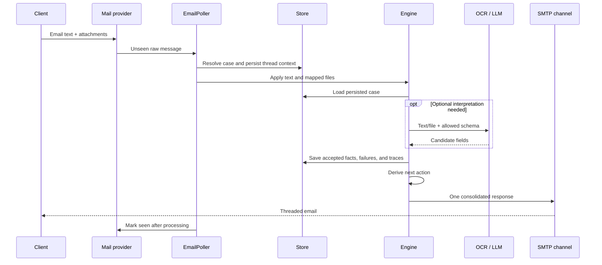
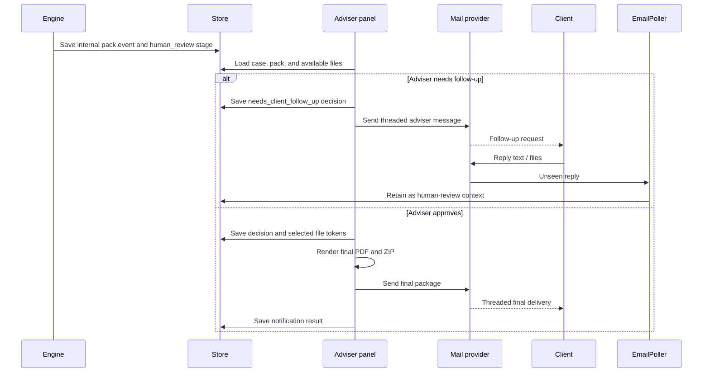

# UK Visitor Visa Preparation Agent — Technical Design Document

Status: PoC implementation baseline  
Audience: engineers and reviewers  
Related document: [README.md](README.md)

## 1. Purpose

This document describes the current implementation of the UK Standard Visitor
preparation agent. It defines the system boundary, components, data flow,
persistence model, model contracts, failure behavior, and verification strategy.

The current verified route is `visitor_family_visit`. The architecture supports
composed route packs, but the tourism and business routes remain unverified
scaffolds.

## 2. Design decisions

### 2.1 Workflow owns high-consequence decisions

The cost of mistakes is asymmetric. Asking one extra clarification is mildly
inconvenient; omitting evidence or fabricating a fact can materially harm the
client. Requirements, workflow transitions, validation, delivery, and the human
approval gate are therefore deterministic.

`state.next_action(case, checklist)` is a pure function of persisted state. It
decides whether to ask for intake, request evidence, request a replacement,
assemble the adviser pack, or wait for human review. It makes no model call.

The core principle is:

> Model extracts and phrases; code judges and delivers.

### 2.2 Agent versus workflow

| Stage | Owner | Reason |
|---|---|---|
| Case routing and de-duplication | Workflow | Must be repeatable under email retries |
| Intake interpretation | Model-assisted | Clients answer out of order and combine facts in prose |
| Intake schema validation | Workflow | Only declared, type-correct fields may enter state |
| Checklist generation | Workflow | Requirements come from versioned, sourced rule packs |
| Document text extraction | Deterministic/OCR | File handling should not depend on conversation context |
| Document field extraction | Model-assisted | Layout and wording vary; output remains schema-constrained |
| Document validation | Workflow | Field, date, identity, and cross-file checks are explicit code |
| Whole-case analysis | Model-assisted | Connections can be useful, but every claim needs exact evidence references |
| Narrative drafting | Model-assisted | Language generation is useful after facts are locked |
| Pack assembly and sending | Workflow | Contents and delivery must be auditable |
| Final case-strength judgement | Human | The genuine visitor test has no safe deterministic threshold |

“Model-assisted” means optional candidate generation. Failure or invalid output
does not transfer control to the model; it causes deterministic fallback,
clarification, or escalation.

### 2.3 State, not transcript

Conversation history is not workflow state. Every inbound message is converted
into persisted facts, evidence records, or human-review messages. The next turn
reloads the case from SQLite and re-derives the next action. This makes retries,
out-of-order answers, later document replacement, and process restarts
reproducible.

### 2.4 Rules have provenance

Requirements live in versioned YAML, not prompts. Each enforceable requirement
resolves to a source in `config/sources.yaml`. Blocking checks affect workflow
completeness; advisory checks remain visible but cannot force replacement as if
practice were law. There is no hardcoded minimum bank balance because the Visitor
rules do not define one.

### 2.5 Models produce candidates, not decisions

The same containment pattern applies to every LLM seam:

1. code constructs the allowed input and output schema;
2. the model proposes candidate data or prose;
3. code validates types, fields, exact fact references, and forbidden claims;
4. accepted output re-enters the deterministic workflow; and
5. invalid output is rejected, repaired once where allowed, or escalated.

The system stores inputs, candidate/accepted/rejected output, and validation
errors. It does not request or persist model chain-of-thought.

### 2.6 Human review is a real gate

Completing automated checks creates an internal adviser pack, not a final client
deliverable. The adviser can request follow-up or approve an explicit set of
files. Only approval creates the client PDF and final ZIP.

### 2.7 Stability controls

| Failure mode | Control |
|---|---|
| Invented requirement | Versioned rule packs with source IDs |
| Practice presented as law | Advisory checks cannot block |
| State drift | SQLite state plus pure next-action derivation |
| Duplicate inbound message | Persisted de-duplication key |
| Silent outbound loss | Persist-before-send outbox and notification trace |
| Unreadable document accepted | Extraction refusal becomes a blocking resupply request |
| Upload-order-dependent result | Revalidate all supplied evidence after every file |
| LLM invented/unsupported claim | Schema checks, exact evidence refs, and fact guard |
| Premature delivery | Mandatory `human_review` stage |
| Wrong final files | Reviewer selection plus one report-and-materials ZIP |

## 3. Goals and non-goals

### Goals

- Accept first-contact and multi-turn client email.
- Convert natural-language intake into validated case fields.
- Derive the required evidence list from versioned rule configuration.
- Accept real PDF, DOCX, text, image, and scanned-PDF attachments.
- Extract governed fields and run deterministic validation.
- Request all known replacement issues in a consolidated response.
- Produce evidence-backed whole-case notes for a human adviser.
- Support adviser follow-up, file inspection, final selection, and approval.
- Send one final ZIP containing the report and selected accepted materials.
- Persist enough trace data to reconstruct the workflow result.

### Non-goals

- Visa application submission.
- Outcome prediction or evidence-sufficiency judgement.
- Production security, scale, availability, or multi-tenant administration.
- Automatic document authenticity or fraud determination.
- Live use of unverified route scaffolds.

## 4. System architecture

### 4.1 Architectural style

The PoC is a **single-repository modular monolith with three executable entry
points**, not a set of networked microservices:

- `demo.py` runs the workflow offline with in-memory adapters;
- `email_poll_once.py` runs one live mailbox ingestion cycle; and
- `admin_panel.py` runs the local adviser-review HTTP surface.

The live entry points are separate OS processes. They coordinate through one
SQLite database and a shared attachment directory; there is no in-process event
bus or hidden conversational memory. Domain behavior is split into small modules
under `src/`, while provider-specific email, OCR, and LLM behavior stays behind
adapter seams.

This shape is intentional for a two-day PoC: it keeps the full control contract
visible and testable without introducing distributed-systems failure modes. The
module boundaries are also the replacement seams for production infrastructure.

### 4.2 Runtime topology and system context

```text
                           external trust boundary
   +------------------+                                  +------------------+
   | Client mailbox   |<------------- SMTP ------------>| Mail provider    |
   +--------+---------+                                  +--------+---------+
            |                                                       |
            | email + attachments                          unseen mail / IMAP
            |                                                       |
            v                                                       v
   +--------------------------------------------------------------------------+
   | email_poll_once.py                                                       |
   |  EmailPoller -> Engine -> state/checklist/validators -> composer/router  |
   +----------------------+----------------------+----------------------------+
                          |                      |
                          | optional candidate   | saved attachment bytes
                          v                      v
              +----------------------+   +-----------------------+
              | LLM / Baidu OCR APIs |   | Attachment directory  |
              +----------------------+   +-----------+-----------+
                                                     |
                          case state + traces         |
                          v                           |
                    +-----+---------------------------+-----+
                    |               SQLite                 |
                    +-----+---------------------------+-----+
                          ^                           |
                          | review/query              | known case file refs
                          |                           v
                    +-----+-------------------------------+
                    | admin_panel.py                      |
                    | adviser decision + package selection|
                    +----------------+--------------------+
                                     |
                                     +------ SMTP reply / final ZIP ------> client
```

All business behavior can run locally. SMTP/IMAP, Baidu OCR, and an
OpenAI-compatible model endpoint are optional external adapters. The offline demo
replaces those adapters with deterministic in-memory implementations but uses the
same state, checklist, validation, diagnosis, and delivery modules.

### 4.3 Runtime roles

| Runtime | Trigger | Reads | Writes | External side effects |
|---|---|---|---|---|
| Offline demo | Developer command | Config + synthetic scripted input | In-memory store | None |
| Mailbox poller | One command or external scheduler tick | IMAP, config, SQLite, saved files | SQLite, attachment directory | SMTP reply; optional OCR/LLM calls |
| Adviser panel | Local HTTP request | SQLite, config, case-known files | Review/notification rows in SQLite | SMTP follow-up or final ZIP |

The PoC does not contain an internal scheduler. Repeated mailbox polling is an
operational concern outside the application process. This prevents a local demo
loop from being mistaken for a durable production worker.

### 4.4 Logical layers and dependency direction

```text
Entrypoints / presentation
  demo.py | email_poll_once.py | admin_panel.py
                         |
                         v
Application orchestration
  EmailPoller | Engine | adviser review actions
                         |
             +-----------+-----------+
             v                       v
Deterministic domain/control       Candidate interpretation
  state, checklist, validate,        ingress, email_model,
  diagnose, facts, compose,          document_extract, case_analysis
  deliver                            optional LLM/OCR adapters
             |                       |
             +-----------+-----------+
                         v
Infrastructure
  Store/SQLite | SMTP/IMAP channel | filesystem attachments
```

The important dependency rule is about **authority**, not only imports:

- candidate interpretation may propose facts, fields, observations, or prose;
- deterministic domain code decides whether those candidates are admissible;
- only the workflow derives the next action and delivery contents; and
- external adapters cannot transition a case or approve a package.

`admin_panel.py` directly composes Store, delivery rendering, and SMTP helpers.
That is a deliberate PoC shortcut. A production adviser application should move
those operations behind authenticated application services and transaction
boundaries.

### 4.5 Control path versus candidate path

The architecture separates an untrusted interpretation path from the trusted
workflow control path:

```text
email text / document bytes
          |
          v
local parser / OCR / optional LLM
          |
          v
candidate JSON or candidate prose
          |
          v
schema + allow-list + exact-reference + fabrication guards
          |
          v
accepted persisted facts ------------------------------+
                                                        |
versioned route config + persisted case state ----------+
                                                        v
                                             state.next_action()
                                                        |
                                                        v
                                         deterministic validation,
                                         message/pack composition,
                                         human-review gate
```

No prompt output feeds directly into a state transition, checklist requirement,
validation pass, or client delivery. This is the central architecture mechanism
behind the agent/workflow split described in section 2.

### 4.6 Key sequence: inbound client email



For a multi-attachment email, every mapped file is applied before the engine
derives one final response. This batching boundary prevents one inbound email from
creating a burst of contradictory intermediate replies.

### 4.7 Key sequence: human review and final delivery



The adviser panel does not ask the model to approve a case. It records a human
decision, and code deterministically builds the ZIP from that explicit selection.

### 4.8 Data ownership and sources of truth

| Data | Source of truth | Derived/read model | Must not become authority |
|---|---|---|---|
| Workflow stage and accepted intake | `cases` row in SQLite | Audit/admin rendering | Email transcript or model memory |
| Required evidence and checks | Versioned route config | Composed `Checklist` | Model-generated requirement text |
| Accepted document fields/failures | `cases.evidence` | QC/adviser pack | Raw OCR/LLM candidate JSON |
| Original uploaded bytes | Case attachment directory | Admin preview/final selection | Filename alone |
| Interpretation/check history | Trace and audit tables | Debug/review evidence | Chain-of-thought |
| Adviser decision and file selection | `adviser_reviews` | Final PDF/ZIP | Automated completeness result |
| Outbound delivery status | Outbox/notification rows | Operations inspection | SMTP call return without persistence |

SQLite stores the small workflow snapshot needed to derive the next action.
Attachments stay on disk and are referenced by case-known paths. Trace tables
retain candidate and validation evidence without treating raw model reasoning as
state.

### 4.9 Trust boundaries

| Boundary | Untrusted input | Architectural control |
|---|---|---|
| Client -> mailbox | Text, headers, filenames, attachment bytes | Case routing, de-duplication, filename mapping, schema checks |
| Attachment -> extraction | File format, embedded text, OCR content | Allow-listed fields; unreadable becomes resupply; no parser result can approve |
| LLM/OCR provider -> workflow | Candidate fields/observations/prose | Type/schema validation, exact fact refs, forbidden-language and fabrication guards |
| Local file -> adviser browser | Requested path/query parameters | Only case-known evidence/review-file identifiers resolve |
| Adviser -> client delivery | Decision, note, selected file tokens | Allowed decisions, stored selection, sanitized unique ZIP names |

The local admin panel itself is inside the trusted PoC environment and has no
authentication. Section 15 records why it must become an authenticated boundary
before any real-client deployment.

### 4.10 Production replacement seams

| PoC component | Production replacement | Contract to preserve |
|---|---|---|
| Poll-once command | Durable mailbox/event worker | Idempotent inbound application and one consolidated response |
| SQLite Store | Managed relational database | Persisted state remains the only workflow truth |
| Local attachment directory | Encrypted scanned object storage | Immutable case-bound file references |
| Direct SMTP/IMAP | Provider adapter + transactional delivery worker | Thread identity, de-duplication, send outcome trace |
| Local admin panel | Authenticated adviser application/service | Human decision and explicit package selection |
| Direct OCR/LLM HTTP call | Observable provider gateway | Candidate-only authority, timeouts, fallback, trace |

These seams allow infrastructure to change without moving requirements,
transitions, validation, package contents, or approval authority into a model.

## 5. Component map

| Component | Responsibility |
|---|---|
| `demo.py` | Offline deterministic end-to-end workflow walkthrough |
| `email_poll_once.py` | Compose live adapters, fetch unseen mail, process, then mark seen |
| `admin_panel.py` | Local adviser list/detail UI, file access, review decisions, client notification, final ZIP |
| `src/email_bridge.py` | Parse RFC822 mail, resolve case, de-duplicate, save attachments, batch one response |
| `src/real_email.py` | SMTP message construction/sending and IMAP fetch/mark-seen |
| `src/engine.py` | Apply one inbound fact/document, advance state, compose and enqueue response |
| `src/state.py` | Legal stages and pure next-action derivation |
| `src/store.py` | SQLite schema, case persistence, de-duplication, outbox, traces, review records |
| `src/checklist.py` | Compose route rule packs and determine required slots/evidence |
| `src/validate.py` | Deterministic field, date, identity, and cross-document checks |
| `src/document_extract.py` | Local text extraction, Baidu OCR adapter, field candidate validation |
| `src/email_model.py` | Deterministic intake plus optional chat-completions adapters |
| `src/ingress.py` | Intake event/schema validation, bounded repair, trace construction |
| `src/case_analysis.py` | Fact context, governed model/deterministic observations, reference validation |
| `src/diagnose.py` | Computed facts and configured risk observations |
| `src/facts.py` | Generated-narrative fabrication guard |
| `src/compose.py` | Convert a workflow action into client-facing text |
| `src/deliver.py` | Adviser pack data and renderers |
| `src/channels.py` | Channel routing and WhatsApp window behavior |

## 6. Configuration model

`config/routes.yaml` maps a route ID to ordered components. `checklist.load_route`
loads each component and composes slots, evidence, risk factors, home ties, and
genuine-visitor-test data into one `Checklist`.

The verified route composition is:

```text
visitor_family_visit
  = standard_visitor_core
  + purposes/family_visit
  + applicant_financial_home_profile
```

Each evidence definition may include:

- `required: always` or a `required_when` condition;
- an ordered `extract` field allow-list;
- deterministic `checks`;
- a `source` ID; and
- advisory metadata where a check reflects practice rather than law.

`config/sources.yaml` is the provenance registry. `Checklist.unsourced()` reports
missing or dangling source references. `data_status` distinguishes verified data
from scaffold data.

`config/case_analysis_rubric.yaml` separately governs whole-case observation
dimensions, legal limbs, allowed question actions, source references, output
shape, and maximum observation count.

## 7. State machine

### 7.1 Stages

| Stage | Meaning |
|---|---|
| `intake` | Required case-profile slots are incomplete |
| `checklist` | Intake is complete and the checklist has been instantiated |
| `collecting` | Required evidence is being gathered |
| `remediation` | At least one required item has a blocking validation failure |
| `assembling` | Required evidence is present/passing and the adviser pack is being built |
| `human_review` | Automated work is complete; an adviser decision is required |
| `escalated` | Automation cannot safely proceed |

`state.transition` rejects any edge absent from the explicit transition table.

### 7.2 Next-action priority

`state.next_action(case, checklist)` returns exactly one action in this order:

1. wait if escalated;
2. ask for the first missing intake group;
3. request replacements for blocking failures;
4. request the first absent required evidence item;
5. wait if already in human review; otherwise deliver the internal adviser pack.

Failures are ordered by checklist order, not upload time. A remediation response
can contain all current evidence failures so a multi-file email does not lead to
serial one-file-at-a-time error messages.

## 8. Email processing flows

### 8.1 New or continuing email

1. IMAP returns an unseen raw message.
2. `parse_email` extracts sender, `Message-ID`, subject, plain-text body, reply
   headers, and attachments.
3. Known automated sender domains are ignored.
4. `EmailPoller.resolve_case` applies the routing order in section 8.2.
5. The latest inbound thread context is persisted for future replies.
6. If the case is in `human_review`, the body/files are stored as review context
   and automation stops.
7. Otherwise, text without mapped attachments goes through `Engine.handle_reply`.
8. Every mapped attachment is saved and applied with a unique de-duplication key.
9. After all attachments are applied, the engine derives and sends one response.
10. Only after processing completes does `email_poll_once.py` mark the IMAP row seen.

### 8.2 Case identity

The subject token format is `[visa-agent:<case-id>]`. Outbound mail also persists
its generated `Message-ID`. Replies can therefore resolve through
`In-Reply-To`/`References` even if the subject changes.

For a new, unthreaded attachment email, the poller may route by sender only when
that sender has exactly one active case. Ambiguity creates a new case rather than
silently attaching evidence to the wrong client record.

### 8.3 Attachment mapping

The evidence ID is inferred from a normalized filename or a small alias map.
Examples: `passport.pdf`, `bank_statements_may.pdf`, `flight_booking.pdf`.
Unmapped files are audited but do not enter validation automatically.

## 9. Intake processing

The active workflow action supplies the schemas for all currently missing slots.
`EmailDemoModel` combines parsers in this order:

1. optional OpenAI-compatible candidate parser;
2. deterministic natural-language parser.

The ingress layer merges candidates and validates each value with the declared
slot type/enum. When the model candidate is partially invalid, one repair request
may receive the original text, schema, accepted fields, and errors. Repair cannot
overwrite already accepted fields.

The engine persists accepted facts and an `ingress_events` trace. Invalid values
never enter `cases.slots`; the normal next-action function asks again for what is
still missing.

## 10. Document processing

### 10.1 Text acquisition

`HybridDocumentTextExtractor` tries deterministic local extraction first:

- UTF-8-compatible text, Markdown, and CSV;
- DOCX body text;
- visible text in simple PDFs; and
- `.ocr.txt` sidecars for offline fixtures.

If local extraction cannot read an image or scanned PDF and Baidu OCR is
configured, `BaiduOcrTextExtractor` handles it. Scanned PDFs are converted to a
first-page PNG in the current PoC before OCR.

### 10.2 Field extraction

The checklist's `extract` list is the allow-list. Label/value parsing runs first.
The optional document LLM receives the document text and only the still-missing
field names. Candidate keys outside the allow-list are rejected.

The result stores raw text, candidate/accepted/rejected JSON, validation errors,
provider/model, and status in `document_extraction_events`.

### 10.3 Validation

`validate.run_checks` implements the supported check kinds, including presence,
name matching, date coverage/ordering, recency, slot-date equality, and
cross-document consistency. An unknown check raises `UnknownCheck`; it cannot
silently pass.

After every upload, the engine re-runs checks for all supplied required evidence.
This removes upload-order dependence from cross-document validation. Blocking
failures move collection into remediation. Advisory-only failures remain visible
but count as satisfied for workflow completion.

Unreadable files are stored with a blocking `unreadable` failure and lead to a
replacement request.

## 11. Whole-case analysis and deliverables

### 11.1 Fact context

`case_analysis.build_fact_context` creates a flat, addressable map:

```text
intake.<slot>
<evidence_id>.<field>
computed.trip_length_days
computed.funds_difference_gbp
computed.home_tie_coverage_count
```

The optional analysis model sees this map and the rubric, not an uncontrolled
email transcript.

### 11.2 Candidate enforcement

Every observation must match an allowed dimension, limb, and observation type.
Each `evidence_ref` key must exist and its cited value must equal the persisted
fact. Each source reference must be allowed for the selected dimension. Forbidden
outcome/sufficiency terms and prohibited follow-up actions cause rejection.

When the model is disabled or fails, deterministic candidates cover selected
long-stay, funds-context, and settled-relative review patterns. These observations
remain questions for the adviser, not verdicts.

### 11.3 Internal adviser pack

`deliver.build_pack` produces:

- document checklist;
- form-answer draft;
- guarded optional cover-letter draft;
- deterministic QC report; and
- whole-case analysis.

The engine writes an outbox row, builds the internal review attachment, transitions
through `assembling`, and enters `human_review`. It does not send this internal pack
to the client as a completed application.

## 12. Adviser review and final package

The local admin panel reads the same SQLite database. It separates waiting and
reviewed cases, renders case facts, accepted evidence, the review pack, and
human-review messages/files, and restricts file preview/download to document
references already known to the case.

Decisions are:

- `needs_client_follow_up`: send the adviser's message in the existing email
  thread; additional replies/files are retained as human-review context for the
  adviser; or
- `approved_for_final_report`: lock the decision controls, render the client PDF,
  and create one ZIP from the explicit reviewer selection.

The ZIP contains `visa-final-review-report.pdf` and selected files under
`materials/`. Names are sanitized and made unique. Failed, missing, and unselected
evidence is not included.

Notification attempts and provider message IDs are stored in
`adviser_notifications`.

## 13. Persistence model

SQLite is initialized by `src/store.py`. The main table groups are:

| Group | Tables |
|---|---|
| Case state | `cases`, `audit`, `workflow_events` |
| Delivery safety | `inbound`, `outbox` |
| Email identity | `email_message_cases`, `email_sender_cases`, `email_thread_contexts` |
| Model/check traces | `ingress_events`, `document_extraction_events`, `validation_events`, `generation_events` |
| Human review | `adviser_reviews`, `adviser_notifications`, `human_review_messages`, `human_review_files` |

`cases.slots` and `cases.evidence` are JSON snapshots used for next-action
derivation. Trace tables preserve the inputs and decisions needed for debugging
without treating model chain-of-thought as a system artifact.

The PoC creates missing tables/columns at startup. Production should replace this
with ordered migrations and transactional units of work.

## 14. Failure behavior

| Failure | Behavior |
|---|---|
| Duplicate inbound key | Ignore and audit; do not send another prompt |
| Intake parse refusal | Keep state unchanged and ask for the same missing facts |
| Invalid intake candidate | Keep valid fields, reject invalid fields, ask for remainder |
| Missing/invalid document fields | Store failures and request replacement or clarification |
| OCR/model unavailable | Fall back where defined; otherwise mark unreadable, never pass |
| Unknown evidence/check | Escalate or raise; never infer a pass |
| Fabricated generated fact | Block pack delivery and escalate |
| Analysis-model failure | Use governed deterministic candidates |
| Ambiguous sender-to-case routing | Create a new case rather than contaminate an existing one |
| SMTP notification failure | Persist failed notification status and error for retry/inspection |

## 15. Security and privacy

The repository contains no required credentials. Secrets enter through environment
variables and must not be committed.

Current PoC controls include case-bound file lookup, structured model output,
allow-listed fields, exact fact references, de-duplication, and audit records.
They are not a production security boundary. The local panel has no authentication,
attachments are written to disk, extraction is not sandboxed, SQLite is not
encrypted, and retention is manual.

Before real-client use, add authentication/authorization, encrypted storage,
malware scanning, file limits and content verification, isolated parsers/OCR,
secret management, retention/deletion workflows, audit access controls, and
prompt-injection treatment for extracted text.

## 16. Operational configuration

| Variable | Purpose |
|---|---|
| `VISA_AGENT_DB_PATH` | SQLite database path |
| `VISA_AGENT_ATTACHMENT_DIR` | Saved inbound attachment root |
| `VISA_AGENT_CASE_ID` | Optional fixed-case demo override |
| `VISA_AGENT_SMTP_*`, `VISA_AGENT_IMAP_*` | Live mailbox connection |
| `VISA_AGENT_EMAIL_USER`, `VISA_AGENT_EMAIL_PASSWORD` | Mailbox credential |
| `VISA_AGENT_FROM_EMAIL`, `VISA_AGENT_TO_EMAIL` | Default sender/client addresses |
| `VISA_AGENT_BAIDU_OCR_API_KEY`, `VISA_AGENT_BAIDU_OCR_SECRET_KEY` | OCR adapter |
| `VISA_AGENT_LLM_API_KEY`, `VISA_AGENT_LLM_MODEL`, `VISA_AGENT_LLM_BASE_URL` | Intake/document model |
| `VISA_AGENT_LLM_TIMEOUT` | Intake/document request timeout |
| `VISA_AGENT_CASE_ANALYSIS_LLM` | Explicit opt-in for model whole-case analysis |
| `VISA_AGENT_CASE_ANALYSIS_LLM_MODEL` | Whole-case analysis model |
| `VISA_AGENT_CASE_ANALYSIS_LLM_TIMEOUT` | Whole-case request timeout |

See the adapter code for provider aliases and fallback `DEEPSEEK_*` variables.

## 17. Verification strategy

Run the complete local verification:

```bash
python3 -m unittest discover -s tests
python3 demo.py
python3 demo.py --email-only
git diff --check
```

The suite covers state transitions, next-action ordering, configuration
provenance, advisory/blocking behavior, de-duplication, email parsing/routing and
threading, multi-attachment batching, real document extraction, OCR seams,
schema repair and traces, cross-file revalidation, fabrication blocking,
whole-case candidate validation, human-review continuation, admin file access,
and final ZIP selection.

External smoke tests should use dedicated test accounts. They are intentionally
separate from the deterministic regression suite.

## 18. Production evolution

The next production architecture should preserve the contracts above while
replacing PoC infrastructure:

- SQLite -> managed relational database with migrations and tenant boundaries;
- poll-once script -> durable mailbox/event workers;
- audit-style outbox -> transactional outbox worker with idempotent send recovery;
- local file paths -> encrypted object storage with scanning and signed access;
- local admin panel -> authenticated adviser application with role controls;
- best-effort provider calls -> observable clients with budgets, retries, and circuit breakers;
- static rule updates -> reviewed, versioned, effective-dated rule publication; and
- example tests -> labeled evaluation sets and continuous quality monitoring.

No infrastructure upgrade should give a model authority over requirements,
workflow transitions, deterministic validation, package contents, or the human
approval gate.
